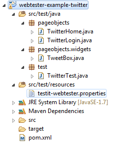

[Home](../README.md)

# Getting Started with WebTester

## What you'll create
You'll write a simple GUI test for [Twitter](https://twitter.com/) using WebTester that tests basic login
as well as tweeting a simple message. The end result will be similar to this:


## What you'll need

- About 30 Minutes
- Eclipse (You can use any IDE, but the guide is using Eclipse)
- Java 1.7 or newer

## Create the project
Open Eclipse and create a new Maven project. Leave the default values until the group and artifact Id need be to specified.
Set the group Id to "info.novatec.testit" and the artifact Id to "webtester-example-twitter".
Set up the project and create the files as depicted below.



Configure the Maven project to look like this and replace `${webtester-version}` with the version you want to use:

```xml
<project
    xmlns="http://maven.apache.org/POM/4.0.0"
    xmlns:xsi="http://www.w3.org/2001/XMLSchema-instance"
    xsi:schemaLocation="http://maven.apache.org/POM/4.0.0 http://maven.apache.org/xsd/maven-4.0.0.xsd">
    <modelVersion>4.0.0</modelVersion>
 
    <groupId>info.novatec.testit</groupId>
    <artifactId>webtester-example-twitter</artifactId>
    <version>0.0.1-SNAPSHOT</version>
    <packaging>jar</packaging>
 
    <name>webtester-example-twitter</name>
    <url>https://documentation.novatec-gmbh.de/display/TESTIT</url>
 
    <dependencies>
        <dependency>
            <groupId>info.novatec.testit</groupId>
            <artifactId>webtester-support-firefox</artifactId>
            <version>${webtester-version}</version>
        </dependency>
        <dependency>
            <groupId>info.novatec.testit</groupId>
            <artifactId>webtester-support-junit</artifactId>
            <version>${webtester-version}</version>
        </dependency>
        <dependency>
            <groupId>junit</groupId>
            <artifactId>junit</artifactId>
            <version>4.12</version>
        </dependency>
        <dependency>
            <groupId>ch.qos.logback</groupId>
            <artifactId>logback-classic</artifactId>
            <version>1.1.3</version>
        </dependency>
    </dependencies>
 
    <repositories>
        <repository>
            <id>novatec</id>
            <name>NovaTec Public Repository</name>
            <url>http://repository.novatec-gmbh.de/content/repositories/novatec/</url>
        </repository>
    </repositories>
 
    <build>
        <plugins>
            <plugin>
                <groupId>org.apache.maven.plugins</groupId>
                <artifactId>maven-compiler-plugin</artifactId>
                <version>3.1</version>
                <configuration>
                    <source>1.7</source>
                    <target>1.7</target>
                    <compilerVersion>1.7</compilerVersion>
                    <encoding>UTF8</encoding>
                    <showWarnings>true</showWarnings>
                    <showDeprecation>true</showDeprecation>
                </configuration>
            </plugin>
        </plugins>
    </build>
 
</project>
```

Create a new file: `testit-webtester.properties` and set your twitter credentials:
```properties
twitter.username=INSERT_TWITTER_USERNAME
twitter.password=INSERT_TWITTER_PASSWORD
```

## Create PageObject for Login Page
After you've set up the project it's time to start writing some code.

To login into your Twitter account we need to setup a PageObject for the Login Page. Open the TwitterLogin
class and have it extend the PageObject class. Now we need to find the respective HTML elements to interact
with on the Twitter page. WebTester can identify Objects by id, class, xpath or css using Selenium. After inspecting
the HTML source of the Twitter Login Page you'll need to find the Objects you can interact with. In this case the login
button, the username field and the password field. We'll identify these two fields by id, while we'll use the class to
get the login button.

We need to make sure that we are on the correct page @PostConstruct of the PageObject. To achieve this the page title
is matched with the title we expect. In our case the title should be the following.

> Welcome to Twitter - Login or Sign up

For all the gory details, please view the source code below at line 23.

For the login process we need the following methods: setUsername, setPassword, clickLogin, and login. Note that these
methods return type must extend PageObject. It is a representation of the state of the page opened after the methods
execution. 

The methods setUsername and setPassword return instances of TwitterLogin while clickLogin and login return instances
of TwitterHome. 

```java
package pageobjects;
 
import static org.junit.Assert.assertEquals;
 
import info.novatec.testit.webtester.api.annotations.AfterInitialization;
import info.novatec.testit.webtester.api.annotations.IdentifyUsing;
import info.novatec.testit.webtester.api.enumerations.Method;
import info.novatec.testit.webtester.pageobjects.Button;
import info.novatec.testit.webtester.pageobjects.PageObject;
import info.novatec.testit.webtester.pageobjects.PasswordField;
import info.novatec.testit.webtester.pageobjects.TextField;
 
 
public class TwitterLogin extends PageObject {
 
    @IdentifyUsing ( method = Method.CLASS_NAME, value = "primary-btn" )
    private Button loginButton;
    @IdentifyUsing ( "signin-email" )
    private TextField usernameField;
    @IdentifyUsing ( "signin-password" )
    private PasswordField passwordField;
 
    @PostConstruct
    private void assertThatCorrectPageIsDisplayed () {
        assertEquals("Welcome to Twitter - Login or Sign up", getBrowser().getPageTitle());
    }
 
    public TwitterHome login (String username, String password) {
        return setUsername(username).setPassword(password).clickLogin();
    }
 
    public TwitterLogin setUsername (String username) {
        usernameField.setText(username);
        return this;
    }
 
    public TwitterLogin setPassword (String password) {
        passwordField.setText(password);
        return this;
    }
 
    public TwitterHome clickLogin () {
        loginButton.click();
        return create(TwitterHome.class);
    }
 
}
```

**Note:** When using `@IdentifyUsing` with an Id, it's not necessary to explicitly define the method used as Id is the default.

## Create PageObject for Home Page

Similar to the Login Page we create a PageObject representation for the Twitter Home Page.

```java
package pageobjects;
 
import static org.junit.Assert.assertEquals;
 
import info.novatec.testit.webtester.api.annotations.AfterInitialization;
import info.novatec.testit.webtester.api.annotations.IdentifyUsing;
import info.novatec.testit.webtester.api.enumerations.Method;
import info.novatec.testit.webtester.pageobjects.Button;
import info.novatec.testit.webtester.pageobjects.PageObject;
import pageobjects.widgets.TweetBox;
 
 
public class TwitterHome extends PageObject {
 
    @IdentifyUsing ( "tweet-box-home-timeline" )
    private TweetBox tweetBox;
    @IdentifyUsing ( method = Method.CSS, value = 
        ".btn.primary-btn.tweet-action.tweet-btn.js-tweet-btn" )
    private Button sendTweetButton;
    @IdentifyUsing ( method = Method.XPATH, value = 
        ".//ol[@id='stream-items-id']/li[1]//p[contains(@class, 'tweet-text')]" )
    private PageObject latestTweet;
 
    @PostConstruct
    private void assertThatCorrectPageIsDisplayed () {
        assertEquals("Twitter", getBrowser().getPageTitle());
    }
 
    public TwitterHome tweet (String message) {
        setTweetMessage(message).sendTweet();
        return this;
    }
 
    public TwitterHome setTweetMessage (String message) {
        tweetBox.setMessage(message);
        return this;
    }
 
    public TwitterHome sendTweet () {
        sendTweetButton.click();
        return create(TwitterHome.class);
    }
 
    public String getMessageOfLatesTweet () {
        return latestTweet.getVisibleText();
    }
 
}
```

As PageObjects can represent either entire pages or just a certain part of it, we use the TweetBox class as a
representation of Twitter´s TweetBox.

```java
package pageobjects.widgets;
 
import info.novatec.testit.webtester.pageobjects.PageObject;
 
 
public class TweetBox extends PageObject {
 
    public TweetBox setMessage (String message) {
        click();
        getWebElement().sendKeys(message);
        return this;
    }
 
}
```

## Create the Test

The `TwitterTest` must `@RunWith` the `WebTesterJUnitRunner` class for JUnit support.

In this example the `@CreateUsing` annotation specifies the `Browser` to be an instance of Firefox.

The `@EntryPoint` is the initial page used by WebTester. It´s the first page the configured browser navigates to.

The Twitter password and username are taken from the `testit-webtester.properties` file using the `@ConfigurationValue`
annotation.

`@Before` test execution a representational instance of the Twitter Login page (twitter.com) is returned by the
`Browser` as a `TwitterLogin` (created above) object.

During the `@Test` WebTester will use twitterLogin to log in with the username and password specified in the
properties file. After a successful login a tweet containing the current system time is tweeted and the test then
asserts that the tweet has been tweeted.

```java
package test;
 
import static org.junit.Assert.assertEquals;
 
import java.util.Date;
 
import javax.annotation.Resource;
 
import org.junit.Before;
import org.junit.Test;
import org.junit.runner.RunWith;
 
import info.novatec.testit.webtester.utils.Waits;
import info.novatec.testit.webtester.api.browser.Browser;
import info.novatec.testit.webtester.browser.factories.FirefoxFactory;
import info.novatec.testit.webtester.junit.annotations.ConfigurationValue;
import info.novatec.testit.webtester.junit.annotations.CreateUsing;
import info.novatec.testit.webtester.junit.annotations.EntryPoint;
import info.novatec.testit.webtester.junit.runner.WebTesterJUnitRunner;
import pageobjects.TwitterHome;
import pageobjects.TwitterLogin;
 
 
@RunWith ( WebTesterJUnitRunner.class )
public class TwitterTest {
 
    @Resource
    @CreateUsing ( FirefoxFactory.class )
    @EntryPoint ( "https://twitter.com/" )
    private Browser browser;
 
    @ConfigurationValue ( "twitter.username" )
    private String username;
    @ConfigurationValue ( "twitter.password" )
    private String password;
 
    private TwitterLogin twitterLogin;
 
    @Before
    public void initStartPage () {
        twitterLogin = browser.create(TwitterLogin.class);
    }
 
    @Test
    public void testThatMessageCanBeTweeted () throws InterruptedException {
 
        String tweetMessage = "It is " + new Date();
        TwitterHome home = twitterLogin.login(username, password).tweet(tweetMessage);
 
        Waits.waitSeconds(1); // AJAX actions take some time to be performed
        assertEquals(tweetMessage, home.getMessageOfLatesTweet());
 
    }
 
}
```

## Summary
Congratulations! You´ve just developed a simple Twitter login and tweet test with WebTester.
